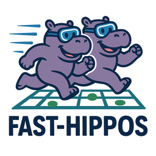
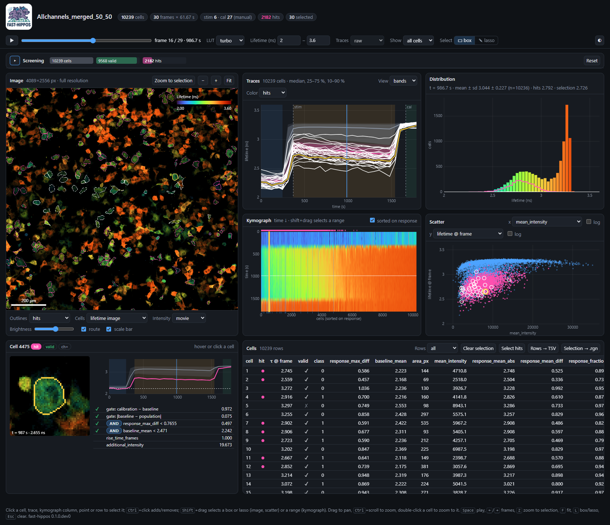
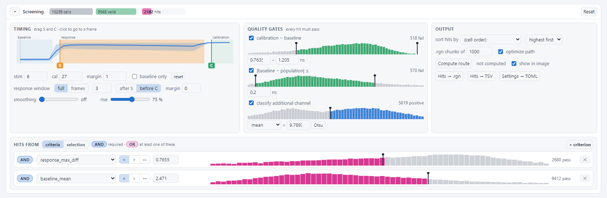
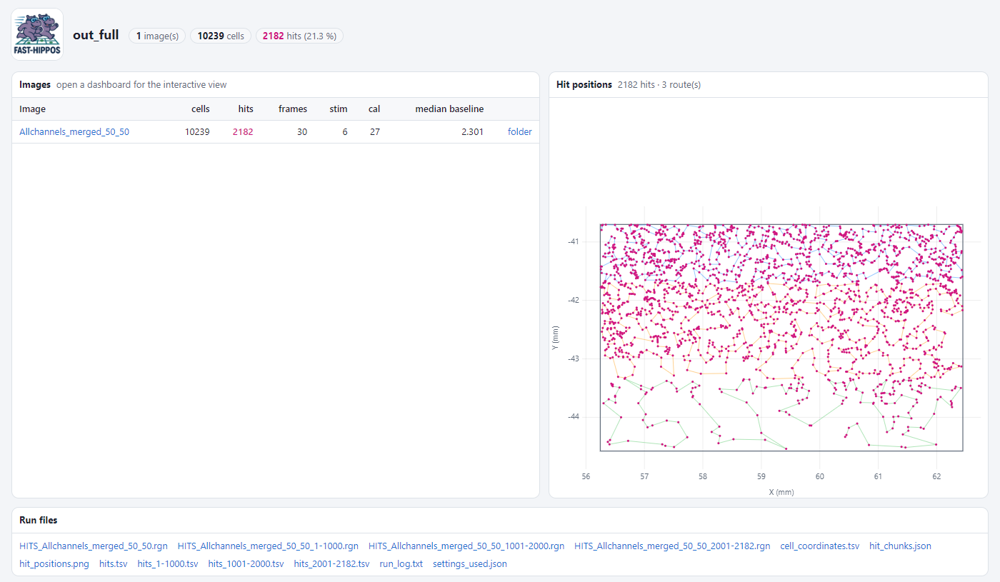

<p align="center">
  
</p>

<h1 align="center">FAST-HIPPOS for Python</h1>

<p align="center">
  <b>F</b>LIM <b>A</b>nalysis of <b>S</b>ingle-cell <b>T</b>races for <b>H</b>it <b>I</b>dentification of
  <b>P</b>henotypes in <b>P</b>ooled <b>O</b>ptical <b>S</b>creening
</p>

<p align="center">
  
</p>

> [!WARNING]
> **Unverified test version.** This Python version is under development and has not yet been validated for
> production screening. Results, settings and file formats may change. For experiments, use the
> [FAST-HIPPOS Fiji plugin](https://imagej.net/plugins/fast-hippos), or check the results carefully against it.

FAST-HIPPOS analyzes multi-cell time-lapse experiments: it segments the cells, measures a fluorescence
lifetime (or ratio, or intensity) trace for every cell, finds the cells with the kinetic behaviour you are
looking for, and writes their stage coordinates as a Leica LAS X `.rgn` file. You can then revisit exactly
those cells for photoactivation, high-resolution imaging, FRAP, and so on. Outside screening it is just as
useful for single-cell trace analysis, visualization and inspection.

This is the Python version of the [FAST-HIPPOS Fiji plugin](https://imagej.net/plugins/fast-hippos)
([GitHub](https://github.com/Jalink-lab/FAST-HIPPOS)). It follows the workflow of the Fiji macro v0.9.5
and brings all results together in **one interactive HTML dashboard per image**. In that dashboard you can also change the hit criteria after the analysis and see
the result immediately.

<p align="center">
  
  <br><sub>Dashboard of a 4089 × 2556 px, 30-frame TCSPC screen with 10 239 cells, zoomed in on a selection of hits.
  All views are linked: the hovered cell (yellow) is highlighted in the image, traces, kymograph, scatter plot and cell card.</sub>
</p>

## Highlights

- **One command, one config file.** `fast-hippos run experiment.toml` runs the whole pipeline. Settings are
  stored in a readable TOML file instead of dialogs, so every analysis is reproducible.
- **FLIM-aware cell lifetimes.** For two-component TCSPC data the fitted amplitudes of all pixels in a cell are
  pooled, giving a robust cell lifetime Σ(A₁τ₁ + A₂τ₂) / Σ(A₁ + A₂), also for dim cells.
- **Cellpose 3 and 4** (Cellpose-SAM), used in-process or from their own Python environments. You can also use
  your own label image or a simple threshold.
- **Interactive dashboard**: a time-lapse viewer with full-resolution tiles for very large stitched images,
  traces, kymograph, distributions, scatter plots, a per-cell card and a sortable table, all linked.
- **Live re-screening**: drag the stimulation and calibration markers, quality gates and hit thresholds, and see
  the hits change immediately. Export the hits as `.rgn`/TSV, or the settings as TOML to apply them to the run.
- **Hand-picked hits**: select cells by box, lasso or kymograph range and use them as the hits.
- **Microscope-ready output**: `.rgn` files in chunks, each with an optimized visiting route (nearest neighbour +
  2-opt), shown on a stage map and as an overlay in the viewer.

## Workflow

| Step | What happens |
|---|---|
| **1. Input** | Multi-channel time-lapse `.tif` (or `.lif` with the `lif` extra). Modalities: TCSPC two-component lifetime images (exported from LAS X), Fast FLIM, TauContrast, frequency-domain FLIM, ratio imaging and plain intensity. Several files can be processed in one run. |
| **2. Pre-processing** | Optional bidirectional-scan phase correction and drift correction (phase cross-correlation). |
| **3. Segmentation** | Cellpose 3/4 on a summed projection of (part of) the time-lapse, or a given label image. Filters on size, circularity and intensity. |
| **4. Traces** | Lifetime (or ratio / intensity) and intensity per cell per frame. |
| **5. Events** | Stimulation and calibration are detected in the second derivative of the population trace, using a robust noise estimate, or set by hand. Traces are split into baseline, response and calibration. |
| **6. Screening** | Per-cell metrics (below), quality gates, and any number of hit criteria, each either *required* (AND) or *one of* (OR). An additional channel can be classified (Otsu) to screen, for example, transfected cells only. |
| **7. Output** | Dashboards, tables, TIFFs, `.rgn` files with optimized routes, and an index page for the run. |

<p align="center">
  
  <br><sub>The screening pane: timeline with draggable stimulation (S) and calibration (C), quality gates and hit criteria,
  each shown on the histogram of its metric together with the number of cells that pass.</sub>
</p>

### Screening metrics

| Metric | Meaning |
|---|---|
| `baseline_mean` | mean lifetime over the baseline |
| `response_mean_abs` | mean lifetime in the timed response window |
| `response_mean_diff` | mean (lifetime − own baseline) in the timed response window |
| `response_fraction` | `response_mean_diff` / `response_max_diff` |
| `response_max_abs` | maximum lifetime over the full response |
| `response_max_diff` | maximum (lifetime − own baseline) over the full response |
| `response_max_diff_pop` | maximum (lifetime − population baseline) over the full response |
| `rise_time_frames` | frames until the response reaches `rise_time_fraction` of its maximum |
| `rapid_response_ratio` | mean difference of the 2nd half / 1st half of the response |
| `calibration_mean` | mean lifetime over the calibration |
| `calibration_diff` | `calibration_mean` − `baseline_mean` |
| `baseline_dev_pop` | `baseline_mean` − population baseline |
| `additional_intensity` | intensity in the additional channel (mean over time, or first frame) |

## Installation

FAST-HIPPOS needs Python ≥ 3.12. Installing with [uv](https://docs.astral.sh/uv/) is recommended:

```powershell
git clone https://github.com/Jalink-lab/FAST-HIPPOS-Python.git
cd FAST-HIPPOS-Python
uv sync                       # creates .venv with all dependencies
uv sync --extra lif           # optional: read Leica .lif files
uv run fast-hippos --help
```

> If the project folder is in a synchronized folder (OneDrive, SURFdrive, Dropbox), keep the environment out of
> it: `$env:UV_PROJECT_ENVIRONMENT = "D:\envs\FAST-HIPPOS\.venv"` (any local, non-synchronized folder) before calling `uv`.

**Cellpose.** You don't need to install Cellpose here. Point the config to existing Cellpose environments
(`segmentation.cellpose3_python` / `cellpose4_python`), and FAST-HIPPOS runs Cellpose there. To install one
of them in this environment instead, use `uv sync --extra cellpose3` or `uv sync --extra cellpose4`.

## Quick start

```powershell
uv run fast-hippos demo                          # synthetic experiment, opens a dashboard
uv run fast-hippos init-config experiment.toml   # annotated example config to edit
uv run fast-hippos run experiment.toml           # full analysis
```

A minimal config for a TCSPC screen:

```toml
[input]
files = ["data/experiment.tif"]
output = "output"
modality = "tcspc"
tau1 = 0.6                     # ns
tau2 = 3.4                     # ns
additional_channel = 3         # optional

[segmentation]
method = "cellpose"
cellpose_model = "cyto3"       # or "cpsam" (Cellpose 4)

[screening]
enabled = true
stage_positions_file = "Stage_positions.txt"
criteria = [
  { metric = "response_max_diff", op = ">", value = 0.6, logic = "AND" },
  { metric = "baseline_mean",     op = "<", value = 2.35, logic = "AND" },
]
```

Frames are 0-based and denote the *first* frame with the stimulus. Channels are 1-based, as in Fiji. See
`fast-hippos init-config` for all options.

## The dashboard

Open `dashboard.html` (per image) or `index.html` (per run) in a browser. It needs no server, no internet and
no Python, so you can share an output folder with anyone. All views are linked: hovering or selecting a
cell anywhere highlights it everywhere.

| Panel | What it shows |
|---|---|
| **Screening** | live re-screening: timeline of the events, quality gates, hit criteria, output and route |
| **Image** | lifetime × intensity time-lapse with live LUT, range and brightness; outlines of hits, selection or all cells; cells coloured by any metric; scale bar; the stage route. Large images load full-resolution tiles while zooming |
| **Traces** | single-cell traces, or, for crowded plots, median with 25–75 % / 10–90 % bands per group (hits, non-hits, selection) or a density map |
| **Kymograph** | all cells (sorted on response) × time |
| **Distribution** | histogram of the current frame, with hits and selection outlined |
| **Scatter** | any two per-cell values, log x/y, box or lasso selection |
| **Cell** | crop of the cell (plays with the time-lapse), its trace against the population, pass/fail of every gate and criterion |
| **Cells** | sortable table; export rows as TSV or the selection as `.rgn` |

**Mouse and keys:**
- Click selects a cell; Ctrl+click adds or removes one.
- Shift+drag selects a box or lasso in the image and scatter plot (`L` toggles), or a range in the kymograph.
- Drag pans, Ctrl+scroll zooms, and double-click zooms to a cell.
- Space plays the time-lapse and ←/→ step through it.
- `Z` zooms to the selection (or the hits), `F` fits the image, and Esc clears the selection.

<p align="center">
  
  <br><sub>The run overview: images, hit counts, and the hit positions on the stage with the optimized route per .rgn chunk.</sub>
</p>

## Changing the hit criteria after the analysis

The **Screening** panel recomputes everything live in the browser from the stored traces. The browser code
gives the same results as the Python pipeline; the test suite checks this.

1. Adjust timing, gates and criteria until the hits look right. Alternatively, switch **Hits from** to
   *selection* and use hand-picked cells as the hits.
2. For a single image, **Hits → .rgn** and **Hits → TSV** give you the final files directly.
3. To apply the settings to the whole run (all images, the combined hit list, `.rgn` chunks with routes, and
   the index page), click **Settings → TOML** and run:

   ```powershell
   uv run fast-hippos reapply experiment.toml --override screening_<image>.toml
   ```

   `reapply` reuses the saved traces: there is no segmentation or measurement, so it takes seconds instead of
   minutes. It is the counterpart of the macro's *re-apply screening settings* option.

## Output

Per run:

| File | Contents |
|---|---|
| `index.html` | run overview with hit map and routes |
| `hits.tsv`, `hits_<a>-<b>.tsv` | hit list, and per chunk in visiting order |
| `HITS_<name>.rgn`, `HITS_<name>_<a>-<b>.rgn` | stage positions for LAS X, all hits and per chunk |
| `cell_coordinates.tsv` | positions of all cells |
| `run_log.txt`, `settings_used.json` | log and the exact settings used |

Per image, in its own folder:

| File | Contents |
|---|---|
| `dashboard.html` | the interactive dashboard |
| `cells.tsv` | all cells with their morphology, metrics, gates and hit status |
| `labels.tif` | segmentation |
| `weighted_lifetime.tif` | lifetime image |
| `kymograph*.tif` | kymographs |
| `lifetime_traces.tsv` | cell traces |
| `traces.png` | trace plot |
| `tiles/` | full-resolution tiles of large images; keep them next to `dashboard.html` when copying |

## Large images

Images larger than `display.dashboard_max_size` (default 1024 px) are embedded as a down-sampled overview. The
full-resolution data is written as a tile pyramid (512 × 512 px tiles) that the viewer loads only for the
visible area. On a 1.9 GB stitched data set (4089 × 2556 px, 30 frames, 10 239 cells), a full run takes about
2.5 min and `reapply` about 30 s, and the dashboard stays responsive.

## Differences from the Fiji macro

- Settings in a TOML file instead of dialogs. Frames are 0-based and denote the *first* frame with the stimulus:
  Fiji manual frames "s,c" become `stimulation_frame = s + 1` and `calibration_frame = c + 1`.
- Stimulation and calibration detection uses a robust (MAD) noise estimate; the default is `sensitivity = 5`.
- TCSPC cell lifetimes pool the fitted amplitudes of all pixels; the Fiji version averages per-pixel lifetimes
  weighted by intensity. The values differ slightly, most for dim cells, so thresholds do not transfer 1:1.
- The Labkit step that refines positions on nuclei is replaced by a scikit-learn pixel classifier
  (`fast-hippos train-classifier`).
- Stitching tiles is still done with the Fiji *Stitch tiles* command; FAST-HIPPOS reads the stage metadata it
  stores in the stitched `.tif`, or a positions file.

The full specification and the validation against Fiji are in [`docs/SPEC.md`](docs/SPEC.md). The reference macro is in [`reference/fiji_v0.9.5`](reference/fiji_v0.9.5).

## Development

```powershell
uv sync                 # includes the dev group (pytest, ruff, mini-racer)
uv run pytest           # Python tests and JavaScript parity tests of the dashboard
uv run ruff check
```

The dashboard is built from `src/fast_hippos/templates/dashboard/*.js` and `templates/screening.js` into a
single self-contained HTML file.

## License and credits

GPL-3.0-or-later. FAST-HIPPOS was developed by Bram van den Broek in the
[Jalink lab](https://github.com/Jalink-lab) at the Netherlands Cancer Institute (NKI), Amsterdam.
